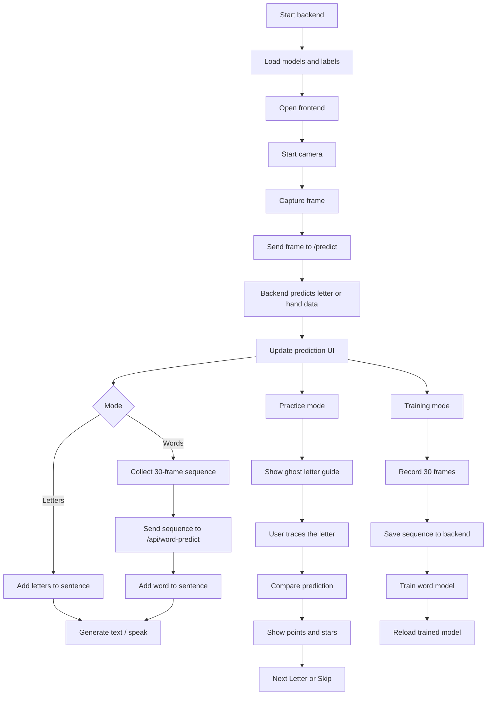

# Program Flow

This project is split into a React frontend and a Flask backend.

## Flow diagram

## Startup flow

1. User starts the backend with `python app.py`, `python backend/app.py`, or `backend/venv311/bin/python backend/app.py`.
2. Backend loads the letter model, word model, labels, and MediaPipe hand/face landmarkers.
3. User opens the frontend with Vite.
4. Frontend boots React from `frontend/src/main.tsx`.
5. `App.tsx` reads the startup state and shows camera and model status.

## Detect flow

1. Webcam starts in the browser.
2. `WebcamDetector` captures a video frame.
3. The frame is sent to `POST /predict`.
4. Backend extracts hand and face landmarks.
5. Backend returns prediction, confidence, and status data.
6. Frontend updates the prediction card and live overlays.

## Letter flow

1. In letter mode, the app shows a single predicted letter.
2. The detected letter can be added to the sentence.
3. The generated text panel builds the sentence one letter at a time.

## Word flow

1. In word mode, the app collects a 30-frame sequence.
2. Frontend sends the sequence to `POST /api/word-predict`.
3. Backend predicts the word using the LSTM model.
4. Detected words are added to a running word list.
5. Frontend can turn the word list into a sentence and paragraph.

## Practice flow

1. Practice mode is available only for letters.
2. The camera shows a ghost hand guide for one letter.
3. User traces the guide with their hand.
4. Backend prediction is compared with the target letter.
5. The app shows result, points, and stars.
6. User clicks `Next Letter` or `Skip` to continue.

## Training flow

1. User enters a new word name.
2. Frontend records 30 frames.
3. Saving sends the sequence to `POST /api/training/save-sequence`.
4. Backend stores the sequence in `backend/sign_data/<word>/`.
5. Training starts through `POST /api/training/train-word-model`.
6. After training, frontend reloads the updated model.

## Output flow

1. Detected letters build sentences.
2. Detected words build a word history.
3. Sentence generation turns words into readable text.
4. Paragraph generation expands the sentence into a short paragraph.
5. Speech synthesis can read the generated text aloud.
